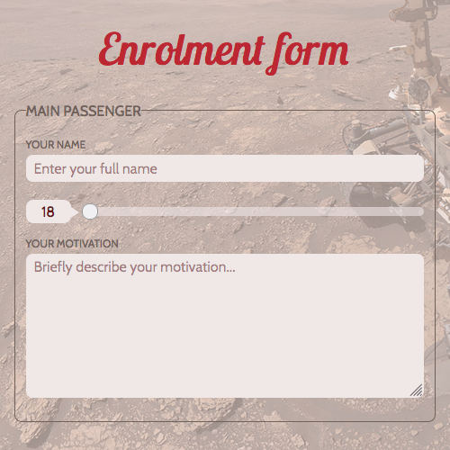

# Description:
Homework project to learn and test different input forms.
# Notes:
- Task originally aimed more towards looking into various input types and their behavior rather than styling.
- Some simple input boxes styling was performed, just for sake of time. Inputs like `number`, `select` or `range` would require more effort (custom arrows, etc.)
- Project was used also to excersise with grid, flex and styling in general (mobile first approach and simple reponsiveness).
- JavaScript was used to add some interaction using `addEventListener`.
# Conclusions:
- Styling non-text input types (like `number`, `range`, `checkboxes`, etc.) may be tricky and complex.
- Input form element styling is highly dependant on web browser used.
# Further Ideas:
- [ ] Add custom outline at `:focus`
- [ ] Add hightlighing of required fields.
- [ ] Disable submit button and enable only when consents are on.
- [ ] Definition of fonts can be probably done better and easier.
# Screenshot:

